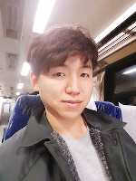

# 남 진 우(南 進 佑)
* 삼성전자, 現 SR-CLab 소속, 2012 - Current 
* 울산과학기술원, 석사, 2010 - 2012
* 부경대학교, 학사, 2002 - 2006 
* 관심분야: 머신러닝, 인공지능 그리고 자기계발(?)

인사말

 안녕하세요. **코딩벅스**라는 필명으로 활동하는 남진우입니다. 취미로 블로그 활동을 하고 있습니다. S/W개발에 대한 글을 주로 작성하고, 가끔 제 생각, 인상깊은 글귀 등 다양한 장르의 글도 올립니다. 제 글에 대한 적극적 관심과 격려는 큰 힘이 됩니다. 감사합니다!

깃헙 코드:  [Github](https://github.com/junimnjw)    

